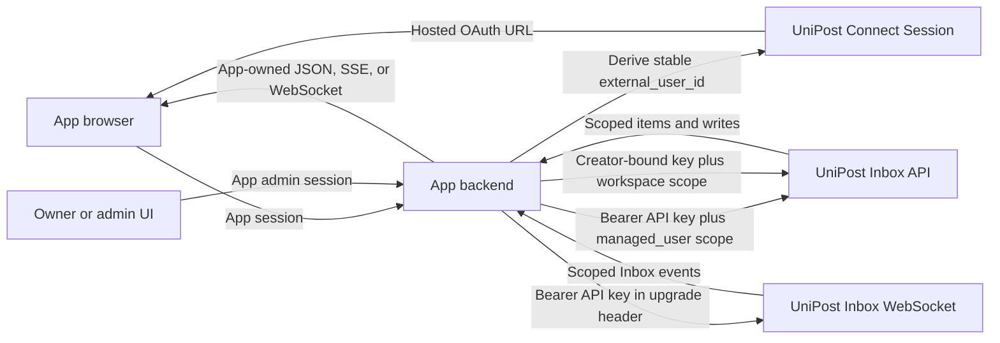

# Inbox App Integration Guide Design

Date: 2026-07-21
Status: Reviewed; awaiting implementation-plan approval
Owner area: Dashboard documentation / Inbox

## Objective

Give an app owner one production-oriented path for embedding UniPost Inbox in their own product while keeping every managed user's comments and direct messages isolated. Correct the Inbox API overview so its endpoint inventory, scope language, authentication guidance, and error contract match the deployed API.

## Audience and outcome

The primary reader owns a multi-user application that lets each authenticated app user connect one or more social accounts through UniPost. By the end of the guide, the reader should be able to:

1. create a stable app-owned `external_user_id`;
2. use that same value in a UniPost Connect Session;
3. expose user-scoped Inbox reads and writes through the app's backend;
4. receive user-scoped real-time events without exposing the workspace API key;
5. expose an aggregate Inbox only to the app's owner/admin surface; and
6. verify A/B isolation with synthetic users before production rollout.

## Scope

### In scope

- Correct `/docs/api/inbox` against the deployed Inbox router and scope contract.
- Add `/docs/guides/inbox-integration` as a complete production integration guide.
- Add navigation, sitemap, cross-links, and documentation search coverage.
- Add source-level regression tests for the security-critical guidance.
- Validate the rendered page and navigation in an isolated Vercel Preview.

### Out of scope

- API or database behavior changes.
- Meta, X, or other provider developer-console changes.
- Publishing and Analytics behavior.
- A new SDK abstraction.
- A browser-side UniPost API client.
- Customer-account or customer-data testing.

## Production API Reference audit

The deployed Inbox overview already documents `inbox_scope`, `external_user_id`, server-side API-key handling, Instagram, Facebook, Threads, and X sources. It still needs the following corrections:

1. Replace workspace-wide wording with selected-scope wording where the response can be managed-user scoped.
2. Present the full router surface:
   - `GET /v1/inbox`
   - `GET /v1/inbox/unread-count`
   - `GET /v1/inbox/{id}`
   - `POST /v1/inbox/{id}/read`
   - `POST /v1/inbox/mark-all-read`
   - `POST /v1/inbox/{id}/reply`
   - `POST /v1/inbox/{id}/thread-state`
   - `GET /v1/inbox/{id}/media-context`
   - `POST /v1/inbox/sync`
   - `GET /v1/inbox/x-outbound-operations/{requestID}`
   - `GET /v1/inbox/ws`
3. Explain both deployed WebSocket authentication paths: customer backends use an API key in the `Authorization` header, while UniPost's own Dashboard uses its Clerk session token in the `token` query field. An API key must never be placed in a WebSocket URL or query field.
4. Expand the shared scope errors to cover missing, invalid, duplicate, or disallowed scope fields, transient managed-user lookup failure (`500 INBOX_SCOPE_LOOKUP_FAILED`), authorization failure, plan gates, and scoped `NOT_FOUND` behavior.
5. Link the overview to the production integration guide.

The existing feature-flag-aware X DM descriptions remain dynamic. The guide must not imply that X DMs are generally available when `x_dms_v1` is disabled.

## Information architecture

### Page identity

- Route: `/docs/guides/inbox-integration`
- Eyebrow: `Guide`
- Title: `Integrate UniPost Inbox into your app`
- Canonical: `https://unipost.dev/docs/guides/inbox-integration`
- Lead: explain that the app backend maps its authenticated user to a stable `external_user_id`, keeps the workspace API key server-side, and calls UniPost with explicit managed-user scope.

### Page structure

1. **What you will build**
   - browser/client talks only to the app backend;
   - app backend owns the UniPost API key;
   - Connect Session and Inbox calls share one stable `external_user_id`;
   - app owner/admin has a separate aggregate route.
2. **Prerequisites**
   - Inbox-eligible plan;
   - workspace API key stored as a server secret;
   - UniPost profile for connected accounts;
   - authenticated app users and stable internal IDs.
3. **Choose the external user ID**
   - use an opaque, immutable app user ID;
   - never use a value supplied directly by the browser;
   - avoid mutable email addresses as the primary key;
   - do not reuse one ID for multiple app users.
4. **Connect a user's social account**
   - create a Connect Session from the backend;
   - pass the app-derived `external_user_id`;
   - redirect the browser only to the returned hosted URL;
   - store the completion result and account ID;
   - handle an ownership conflict as a failed-closed Connect result: if the same provider account is already owned by another `external_user_id`, the hosted Connect flow returns HTTP `409` with “This social account is already connected and cannot be reassigned.” The internal `ACCOUNT_OWNERSHIP_CONFLICT` sentinel is not presented as a public JSON error contract; the app must resolve the identity/ownership conflict rather than silently reassigning the account.
5. **Build a user-scoped backend boundary**
   - derive the current app user from the app's session;
   - add `inbox_scope=managed_user` and the derived `external_user_id` on every UniPost Inbox request;
   - never accept either scope field as an unrestricted browser-controlled value.
6. **Read the Inbox**
   - list items;
   - set `limit` when a bounded page size is needed; the deployed API defaults to `50`, caps the value at `500`, and does not expose cursor pagination, so the guide must not call this cursor-based pagination or imply an unbounded history result;
   - read unread count;
   - fetch a single item;
   - treat scoped `404` as unavailable without attempting to distinguish missing from cross-user.
7. **Perform scoped writes**
   - mark one item read;
   - mark all selected-scope items read;
   - reply to an item;
   - update `thread_status` and `assigned_to`;
   - run a selected-scope manual sync;
   - distinguish the ordinary non-X sync from the optional `x_backfill` operation. X backfill can consume managed X Credits, returns an estimate, and requires the caller to repeat the exact scope/account/request with the short-lived confirmation token when the estimate exceeds the safe threshold. Do not describe every manual sync as metered.
8. **Receive real-time events**
   - establish `GET /v1/inbox/ws` from a trusted backend process;
   - send the API key only in the upgrade `Authorization` header;
   - include the same managed-user scope query;
   - relay allowed events to the browser through the app's own WebSocket or SSE channel;
   - reconnect and perform an authoritative list/unread refresh after interruption.
9. **Build the owner/admin aggregate**
   - use a creator-bound API key whose creator is still owner/admin;
   - send `inbox_scope=workspace` without `external_user_id`;
   - enforce the app's owner/admin role before the server makes the call;
   - keep aggregate endpoints separate from user-scoped endpoints.
10. **Handle errors safely**
    - explain that HTTP middleware evaluates authentication and explicit Inbox scope before the Inbox plan gate, then the selected endpoint runs; a request that is both malformed or mis-scoped and plan-ineligible therefore returns its scope error before `402`;
    - `400` for malformed or missing scope input;
    - `401` for invalid or inactive credentials;
    - `403` for insufficient role, creatorless aggregate key, or controlled feature denial;
    - `404` for missing managed user or an item outside the selected scope;
    - `402` for plan gates;
    - `500 INBOX_SCOPE_LOOKUP_FAILED` for a transient failure while resolving managed-user scope. Because this failure occurs before the selected endpoint runs, the same request may be retried with bounded exponential backoff; do not generalize that guarantee to every `5xx`, especially replies or other writes after an uncertain outcome;
    - provider and X idempotency errors link to exact endpoint references.
11. **Production security checklist**
    - API key is server-only and excluded from logs;
    - app session is verified before deriving `external_user_id`;
    - user-scoped and aggregate handlers are separate;
    - reply IDs and thread IDs are never trusted without selected-scope enforcement;
    - real-time messages are relayed only to the intended app user;
    - logs omit private DM bodies.
12. **Synthetic A/B acceptance**
    - connect or seed app-owned test users A and B;
    - prove A list excludes B and B list excludes A;
    - prove cross-scope get, read, reply, and thread-state return `404`;
    - prove the aggregate path sees both;
    - prove A's real-time channel does not receive B's exact event;
    - remove all synthetic fixtures after the test.

## Data flow and trust boundaries

Trust decisions belong in the app backend. The browser may request actions against its own app session, but it does not choose an arbitrary UniPost scope or receive the UniPost API key.

## Code examples

The guide uses cURL and TypeScript examples that are explicit enough to transfer to other frameworks.

### HTTP examples

- Use native `fetch` in TypeScript so the guide does not introduce an SDK dependency.
- Show a small server-side helper that accepts an app-authenticated user object, not a browser-provided `external_user_id`.
- Build query parameters with `URLSearchParams`.
- Forward only the response fields the app needs.
- Preserve UniPost status codes where useful while keeping credentials and internal provider details out of client logs.

### WebSocket example

- Use the server-side `ws` package because browser-native WebSocket cannot set the required `Authorization` header.
- Include the installation command `npm install ws` in the guide.
- Show a backend-only connection and a conceptual relay callback.
- Do not present a browser example that embeds the UniPost API key in the URL.

### Example identity

Use an opaque sample such as `app_usr_7f4c91` consistently across Connect Session and Inbox requests. Do not use email as the canonical identifier.

## Presentation and component strategy

Reuse the existing documentation system:

- `DocsPage`
- `DocsTable`
- `DocsCodeTabs`
- `ApiInlineLink`
- existing guide badges and guide-note styles

No new visual dependency or custom interactive component is needed. The guide should preserve the existing documentation hierarchy, responsive behavior, theme support, and syntax styling. This avoids a one-off landing-page treatment inside task documentation.

## Navigation and discovery

1. Add an `Inbox integration` card near the top of `/docs/guides`.
2. Add an `Inbox Guides` sidebar group containing the new page and relevant X Inbox guides.
3. Add the new route to the sitemap.
4. Add an Inbox integration chunk to the documentation AI/search index with task-oriented tags and aliases.
5. Link from `/docs/api/inbox` to the guide.
6. Link from the guide to Connect Sessions and the list, reply, and sync endpoint references.

## Error handling in the guide

Examples must fail closed:

- reject an unauthenticated app session before calling UniPost;
- derive scope server-side;
- do not fall back from managed-user scope to workspace scope;
- retry `INBOX_SCOPE_LOOKUP_FAILED` only with bounded exponential backoff; retry other `5xx` responses only where the endpoint is idempotent or has a documented stable idempotency contract;
- do not retry an X reply with a new idempotency key after an uncertain outcome;
- do not auto-reassign a provider account after a Connect ownership conflict;
- do not run scheduled `x_backfill` operations without accounting for the returned X Credit estimate and confirmation flow;
- reconnect real-time transport, then refresh authoritative state;
- avoid returning raw upstream or credential-bearing errors to the browser.

## Testing strategy

### Source-contract tests

Add or extend Dashboard source tests to assert that:

- the API overview includes the complete endpoint inventory;
- the guide uses `managed_user` and derives `external_user_id` server-side;
- the guide forbids browser exposure and URL transmission of API keys;
- owner/admin aggregate uses `workspace` scope with no `external_user_id`;
- the WebSocket example uses an `Authorization` header;
- navigation, sitemap, and search index contain the guide;
- the guide contains A/B isolation acceptance steps;
- the guide distinguishes bounded `limit` behavior from cursor pagination;
- the guide documents pre-plan scope-check ordering and the narrowly retryable `INBOX_SCOPE_LOOKUP_FAILED` case;
- the guide documents Connect ownership conflict and X backfill credit/confirmation behavior without exposing internal-only error sentinels as public contracts;
- no YouTube Inbox source is introduced.

### Build and preview

- run the relevant Node source tests;
- run `npm run build` from `dashboard/`;
- use the isolated Vercel Preview wired to the exact PR API;
- inspect desktop and mobile rendering, table overflow, code tabs, sidebar state, table of contents, canonical, and cross-links;
- keep authenticated Clerk Dashboard regression deferred unless it becomes necessary for shared-shell changes.

## Branch and release strategy

- The conversation-owned `hotfix-inbox-comments-idor` branch is based on the latest `origin/staging`.
- The documentation implementation is committed only on that owned branch and first proposed back to `staging`.
- Before the staging pull request is merged, audit the exact commits and files relative to its staging base and require local CI plus Preview Acceptance on the exact head SHA.
- After staging verification, promote `staging` to `main` through a production pull request and verify the production documentation pages.
- After production verification, synchronize all changes present on `staging` back to `dev`, as explicitly requested by the user.
- Before that full staging-to-dev synchronization, list every unique commit and changed file. Any unidentified or unfinished content remains a blocker even though the intended synchronization scope is all of staging.
- If the staging-to-dev synchronization conflicts, stop and ask the user rather than resolving or discarding changes silently.

## Acceptance criteria

1. An app owner can follow one page from Connect Session through scoped reads, writes, real-time events, and owner/admin aggregate access.
2. Every example keeps the UniPost API key server-side.
3. Every managed-user request derives `external_user_id` from the app's authenticated user.
4. The API overview matches the deployed router and selected-scope semantics.
5. The guide is discoverable from Guides, the sidebar, search, sitemap, and the Inbox API overview.
6. Local build and relevant source tests pass.
7. Preview Acceptance passes on the exact PR head SHA.
8. The task PR to `staging` contains only the documentation changes described here relative to its staging base.
9. The later staging-to-dev synchronization contains the complete, audited staging state and no unidentified or unfinished changes.
